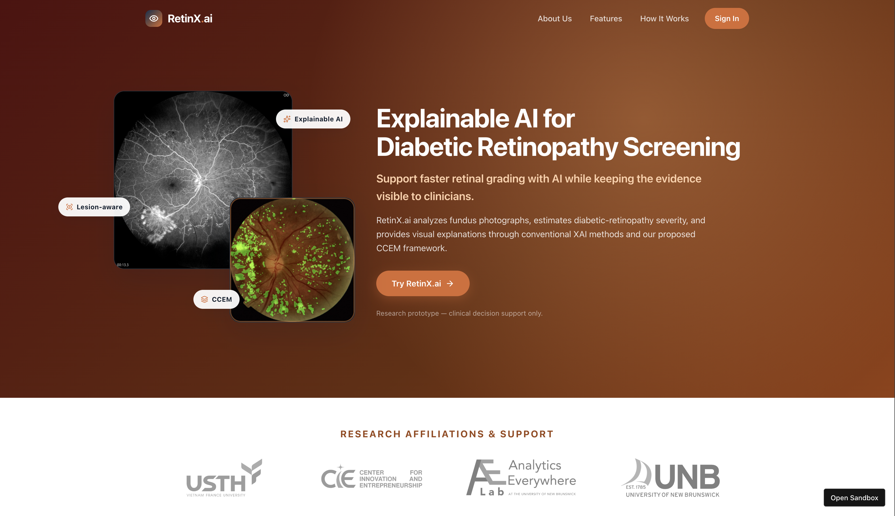

# RetinX.ai

### Explainable AI for Diabetic Retinopathy Grading

**Faster grading. Visible evidence. Clinician control.**

RetinX.ai is a research-driven explainable AI platform designed to support clinicians in grading **Diabetic Retinopathy (DR)** from retinal fundus images.

Unlike conventional black-box classifiers that return only a predicted grade, RetinX.ai is designed to provide both the **AI assessment** and the **visual evidence behind that assessment**, allowing clinicians to inspect the retinal regions that influenced the model's decision.

  

The project builds upon our research on **Lesion-Aware Explainable AI for Diabetic Retinopathy Grading on Fundus Images** and incorporates our proposed **Consensus-Calibrated Explanation Map (CCEM)** framework.

> **Status:** Research prototype / frontend demonstration  
> **Intended use:** Clinical decision support research only  
> **Not intended for autonomous diagnosis or clinical deployment**

---

## Overview

Diabetic Retinopathy is a major complication of diabetes and can lead to irreversible visual impairment if it is not detected and managed in time.

Retinal screening programs generate large numbers of fundus photographs that must be reviewed by trained specialists. RetinX.ai explores how artificial intelligence can support this workflow by:

- estimating diabetic-retinopathy severity;
- presenting results using an ordinal five-grade scale;
- generating visual explanations for AI assessments;
- combining complementary XAI methods through CCEM;
- organizing retinal analyses by patient;
- and, in future versions, allowing clinicians to review, challenge, and correct AI-generated assessments.

The goal of RetinX.ai is **not to replace ophthalmologists**, but to provide an AI-assisted clinical workflow in which medical professionals remain responsible for reviewing the evidence and making the final decision.

  

